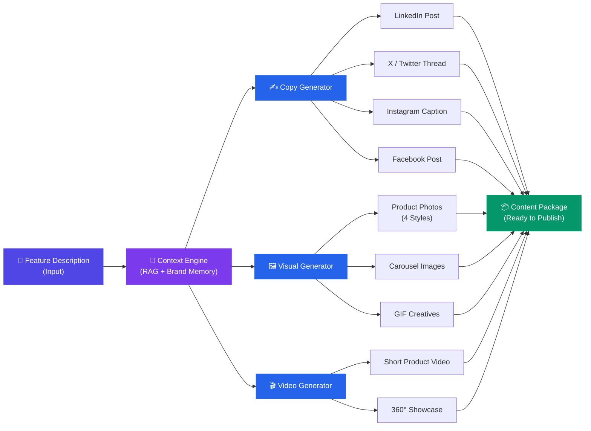
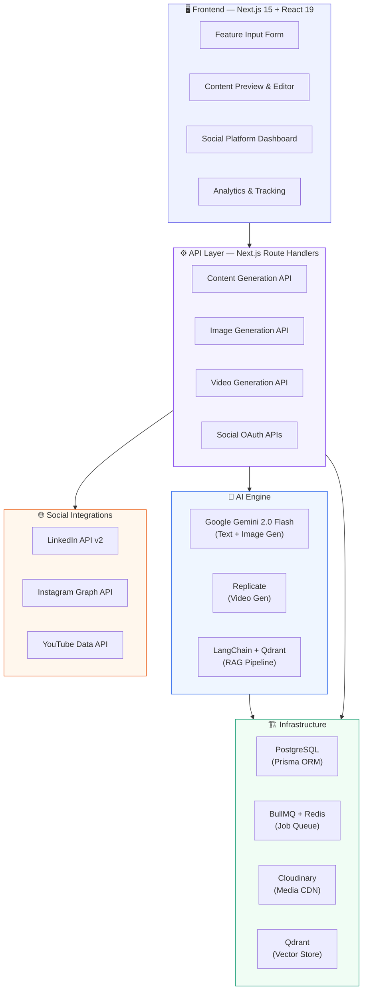
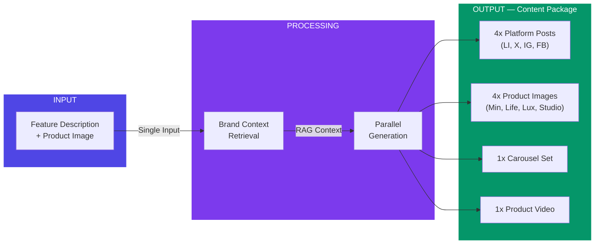

# PPT SLIDE CONTENT — Feature-to-Feed

---

## SLIDE 1 — Brief About the Idea

**Title:** Feature-to-Feed — Zero-Latency Marketing

**The gap:**
Every feature Commudle ships enters a dead zone — the hours (sometimes days) between "feature deployed" and "the world knows about it." In that gap, momentum dies. Not just on social media — across every outreach channel.

**What we're building:**
A single pipeline that takes one feature description and deploys a complete promotional blitz — platform-tuned social posts, AI-generated visuals, promotional video, personalized email campaigns, and even AI voice outreach calls — all grounded in your brand's own voice and context.

**One input. Every channel. Every format. Under 2 minutes.**

| Channel | What Gets Generated |
|---|---|
| Social Media | LinkedIn post, X thread, Instagram caption, Facebook post — each platform-adapted in tone, length, and format |
| Visual Creatives | 4 AI product images (Minimal, Lifestyle, Luxury, Studio), carousel set, GIF creatives |
| Video | Short promotional video + 360° product showcase |
| Email Outreach | AI-personalized emails per lead from CSV — unique subject line, body, and CTA per recipient — sent and tracked automatically |
| Voice Outreach | AI voice agent makes outbound calls to leads with a natural conversation about the new feature, with live transcripts and call summaries |
| Content Package | All assets bundled — preview, edit, export, or publish directly |

The system connects to live social platforms via OAuth (LinkedIn, Instagram, YouTube) to preview how assets will appear and pull engagement analytics post-publish. Email campaigns track open rates and delivery. Voice calls generate transcripts and AI-powered conversation summaries. Everything feeds back into the system.

**The difference:** Other solutions generate text. This generates a complete multi-channel promotional deployment — social posts, images, video, personalized emails, and AI voice calls — all from a single input, all grounded in a RAG-powered brand memory engine that ensures nothing sounds generic.

---

## SLIDE 2 — Problem Understanding

**Title:** The Problem

Commudle ships features fast. But marketing can't keep up — because the content pipeline is still manual.

**Current state:**

Feature Deployed ──→ [DEAD ZONE] ──→ Content Live
                     │
                     ├─ Writer drafts LinkedIn post
                     ├─ Writer rewrites for X/Instagram/FB
                     ├─ Designer creates visuals
                     ├─ Designer adapts to each platform
                     ├─ Video team creates promo clip
                     └─ Review → Revise → Publish

                     ⏱️ 4–8 hours per feature

**Three pain points the problem statement calls out:**

1. No automated bridge between engineering shipping features and marketing deploying content
2. Multi-format demand — not just text, but images, carousels, GIFs, short video. Each platform expects different formats
3. Platform-specific variation — LinkedIn's professional tone ≠ X's punchy brevity ≠ Instagram's visual-first approach

**What the PS explicitly requires:**
- Post captions & launch copy ✓
- Platform-specific variations (LinkedIn, X, Instagram, etc.) ✓
- Visual creatives (image, carousel, GIF, short video) ✓
- Ready-to-publish content package ✓
- Reduce turnaround time to near-zero ✓

---

## SLIDE 3 — Proposed Solution Framework

**Title:** Solution Framework

(USE THE "Solution Pipeline Flow" DIAGRAM HERE)

**Three-stage pipeline:**

**Stage 1 — Context Ingestion**
Before generating anything, the system retrieves brand context. Company documents, brand guidelines, tone preferences, audience definitions, and past content are embedded in a vector database. On every generation request, the most relevant brand context is pulled via similarity search and injected into every prompt. This is what prevents the output from sounding like "generic AI wrote this."

**Stage 2 — Parallel Multi-Modal Generation**
Three engines fire simultaneously — not sequentially:

| Engine | Generates |
|---|---|
| Copy Engine | 4 platform-specific posts: LinkedIn (professional, 1300 chars, 3-5 hashtags), X (punchy, 280 chars, thread-ready), Instagram (emoji-rich, CTA-driven), Facebook (community-focused) |
| Visual Engine | 4 product image styles (Minimal white-bg, Lifestyle in-context, Luxury dramatic lighting, Studio professional) + carousel image set |
| Video Engine | Product showcase video + 360° rotation clip from a single input image |

**Stage 3 — Content Packaging**
All generated assets are bundled into a single preview dashboard. Each piece is editable — tweak the LinkedIn copy, swap an image style, regenerate the video prompt. Once approved, export as a ready-to-publish package or push directly to connected social accounts.

**Why this framework wins:**
Most solutions stop at text generation. This framework treats content as multi-modal by default — the same way real social media works. A LinkedIn post without a visual doesn't get engagement. An Instagram post without the right image format fails. The framework produces the complete package, not just one piece.

---

## SLIDE 4 — Technical Approach & System Architecture

**Title:** Technical Architecture

(USE THE "System Architecture" DIAGRAM HERE)

**Four technical pillars:**

**1 — RAG-Powered Brand Memory**
- Documents, brand guidelines, past content → chunked → embedded (Gemini Embeddings, 768-dim, cosine similarity) → stored in Qdrant vector database
- Every generation call → top-K context retrieval → injected into prompt
- Result: the AI doesn't just know what you're launching — it knows how your brand talks about things

**2 — Multi-Modal AI Generation (Parallel)**
- Text: Gemini 2.0 Flash — generates platform-adapted copy with tone, length, and format controls per platform
- Images: Gemini 2.0 Flash Image Generation — creates product photos across 4 visual styles from a single product image
- Video: Replicate (Wan 2.1 image-to-video + MiniMax Director 360°) — generates short-form video from one static image
- All three engines execute concurrently via async job queue — total pipeline time = slowest engine, not sum of all engines

**3 — Async Job Pipeline**
- BullMQ + Redis manages generation jobs
- Video (slowest at ~60s) doesn't block text/image delivery (< 10s)
- Real-time status polling — UI shows progress per asset type
- Graceful degradation — if video fails, the rest of the package still delivers

**4 — Social Platform Layer**
- OAuth2 integrations with LinkedIn API v2, Instagram Graph API, YouTube Data API v3
- Post-publish engagement metrics (views, likes, comments) pulled back into analytics dashboard
- Creates a feedback loop — measure which generated content performs best, inform future generation

---

## SLIDE 5 — Technology Stack

**Title:** Technology Stack

| Layer | Technology | Why |
|---|---|---|
| Frontend | Next.js 15, React 19, Tailwind v4, shadcn/ui | Server components + streaming UI for real-time generation progress |
| AI — Text + Image | Google Gemini 2.0 Flash | Single model handles both text and image generation — reduces API complexity |
| AI — Video | Replicate (Wan 2.1, MiniMax Director) | Best-in-class open-source video models, no GPU infra needed |
| Brand Memory | LangChain + Qdrant + Gemini Embeddings | Sub-100ms vector retrieval, production-grade RAG pipeline |
| Media CDN | Cloudinary | On-the-fly image transforms, video hosting, format conversion |
| Job Queue | BullMQ + Redis | Handles parallel generation without blocking UI |
| Social APIs | LinkedIn v2, Instagram Graph, YouTube Data v3 | Real OAuth — not mocked integrations |
| Database | PostgreSQL + Prisma ORM | 30+ models — campaigns, content items, analytics, activity logs |
| Rate Limiting | Upstash Redis | Sliding window — prevents API abuse during heavy generation |
| Infra | Docker Compose | One-command deployment: PostgreSQL + Redis + Qdrant + App |

---

## SLIDE 6 — Implementation Roadmap

**Title:** 24-Hour Build Plan

(USE THE GANTT DIAGRAM HERE)

| Phase | Duration | Deliverables |
|---|---|---|
| 1 — Core Pipeline | Hours 0–6 | Feature input form with description + image upload. RAG context engine (Qdrant + embeddings). Multi-platform copy generation with tone/format controls per platform. |
| 2 — Visual & Video | Hours 6–14 | AI product image generation (4 styles via Gemini). Carousel image creation pipeline. Video generation integration (Replicate Wan 2.1 + MiniMax Director). |
| 3 — Package & Connect | Hours 14–20 | Content package bundler — preview all assets in one view. Social platform OAuth connections. Export/download as ready-to-publish bundle. |
| 4 — Polish & Demo | Hours 20–24 | End-to-end pipeline testing. Edge case handling. UI polish. Demo flow preparation. |

**Risk mitigation:**
- Video generation (~60s) is the bottleneck → handled async, never blocks text/images
- If any single generation fails → package degrades gracefully (delivers remaining assets)
- RAG engine falls back to company profile data if no documents are uploaded yet

---

## SLIDE 7 — Expected Impact & Scalability

**Title:** Impact & Scale

**Impact — measured, not claimed:**

| Metric | Current | With Our Solution |
|---|---|---|
| Time per feature launch content | 4–8 hours | < 2 minutes |
| Assets generated per launch | 2–3 (mostly text) | 10+ (text + images + video, all platforms) |
| Platform coverage | 1–2, manually adapted | 4 platforms, auto-adapted |
| Brand consistency | Varies by who writes it | Guaranteed — RAG-grounded in brand docs |
| Cost per launch | $200–500 (freelance/agency) | ~$0.05 in API costs |

**Scalability — four dimensions:**

| Dimension | How |
|---|---|
| Throughput | BullMQ distributes jobs across workers — handles 100+ concurrent generation requests |
| Platforms | Adding a new platform (TikTok, Threads) = one prompt template + one output formatter. Zero architecture changes |
| Content types | New formats (Reels, Stories, Shorts) are pluggable generator modules |
| Data | Qdrant scales to millions of vectors; PostgreSQL + Prisma handles relational growth via migrations |

**Future extensions:**
- Scheduled publishing directly to connected social accounts
- A/B variant testing — generate 3 versions, measure which performs best
- Analytics feedback loop — engagement data improves future generation quality automatically

---

## MERMAID DIAGRAM CODE (paste into mermaid.live to export as PNG/SVG)

### Diagram 1: Solution Pipeline Flow (for Slide 3)

### Diagram 2: System Architecture (for Slide 4)

### Diagram 3: 24-Hour Gantt Roadmap (for Slide 6)

```mermaid
gantt
    title Implementation Roadmap — 24 Hours
    dateFormat HH:mm
    axisFormat %H:%M

    section Phase 1: Core Engine (0-6h)
    Feature input interface & parsing      :a1, 00:00, 2h
    RAG context engine setup               :a2, 01:00, 3h
    Multi-platform copy generation         :a3, 03:00, 3h

    section Phase 2: Visual Assets (6-14h)
    AI image generation (4 styles)         :b1, 06:00, 3h
    Carousel & GIF creation pipeline       :b2, 09:00, 3h
    Video generation integration           :b3, 11:00, 3h

    section Phase 3: Packaging (14-20h)
    Content package bundler                :c1, 14:00, 3h
    Social platform OAuth & preview        :c2, 16:00, 2h
    Analytics & tracking dashboard         :c3, 18:00, 2h

    section Phase 4: Polish (20-24h)
    End-to-end testing                     :d1, 20:00, 2h
    UI polish & demo prep                  :d2, 22:00, 2h
```

### Diagram 4: Input → Output Flow (for Slide 1)

